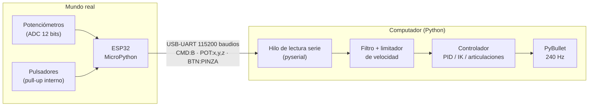
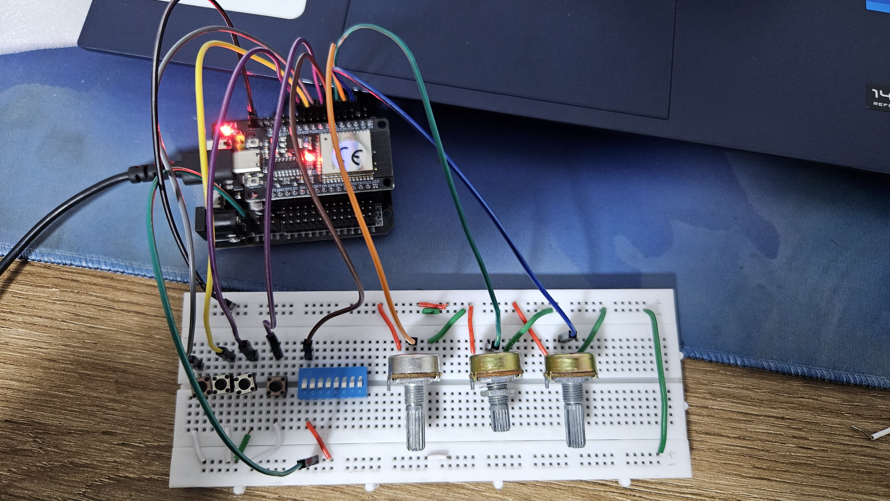
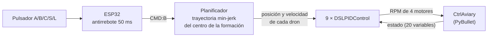
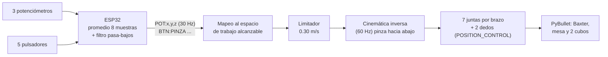
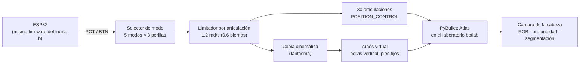

# Taller Segundo Corte — Real-to-Sim con ESP32 y PyBullet

**Universidad Militar Nueva Granada** · Ingeniería Mecatrónica · Microcontroladores
**Autor:** David Felipe Farfán Quiroz
**Fecha:** septiembre de 2026

Una ESP32 funciona como **consola de mandos física** (pulsadores y potenciómetros) y controla tres robots simulados en PyBullet:

| Inciso | Robot | Qué se controla | Repositorio base |
|---|---|---|---|
| **a** | Enjambre de 9 drones Crazyflie | Traslado en formación del punto A al B y al C | [gym-pybullet-drones](https://github.com/utiasDSL/gym-pybullet-drones) |
| **b** | Baxter (brazos industriales) | Posición de cada brazo, giro de muñeca, pinza para coger y mover un cubo | [pybullet_robots / baxter_ik_demo.py](https://github.com/erwincoumans/pybullet_robots/blob/master/baxter_ik_demo.py) |
| **c** | Atlas (humanoide) | Brazos, torso, cabeza, sentadilla y cámara de la cabeza | [pybullet_robots / atlas.py](https://github.com/erwincoumans/pybullet_robots/tree/master) |

---

## Contenido
1. [Arquitectura general](#1-arquitectura-general)
2. [Materiales](#2-materiales)
3. [Estructura del repositorio](#3-estructura-del-repositorio)
4. [Instalación paso a paso](#4-instalación-paso-a-paso)
5. [Inciso a — Drones A → B → C](#5-inciso-a--drones-a--b--c)
6. [Inciso b — Consola para el Baxter](#6-inciso-b--consola-para-el-baxter)
7. [Inciso c — Consola para el Atlas](#7-inciso-c--consola-para-el-atlas)
8. [Problemas encontrados y soluciones](#8-problemas-encontrados-y-soluciones)
9. [Conclusiones](#9-conclusiones)
10. [Referencias](#10-referencias)

---

## 1. Arquitectura general

El concepto **real-to-sim** consiste en que una acción física en el mundo real (girar una perilla, pulsar un botón) se traduce en tiempo real en un movimiento dentro de la simulación.



**Decisiones de arquitectura:**

- **La ESP32 solo lee y envía.** No calcula nada del robot, así el mismo firmware sirve para el Baxter y el Atlas (incisos b y c). Todo el control (cinemática inversa, PID, suavizado) corre en el PC, que tiene la capacidad de cómputo.
- **Protocolo de texto con prefijo.** Cada mensaje es una línea que empieza por `CMD:`, `POT:` o `BTN:`. El PC ignora cualquier otra línea, como los mensajes de arranque de la ESP32, y así no se interpretan como órdenes por error.
- **Lectura serie en un hilo aparte.** La simulación nunca se bloquea esperando datos del puerto.
- **Suavizado en dos etapas.** La ESP32 promedia 8 muestras y aplica un filtro pasa-bajos. En el PC hay otro filtro y un limitador de velocidad. El resultado es un movimiento fluido aunque la perilla se gire de golpe.

### Protocolo serie

| Mensaje | Origen | Inciso | Significado |
|---|---|---|---|
| `CMD:A`, `CMD:B`, `CMD:C` | Pulsador | a | Llevar la formación al punto A, B o C |
| `CMD:S` | Pulsador | a | Secuencia automática A → B → C |
| `CMD:L` | Pulsador | a | Aterrizar |
| `POT:x,y,z` | 3 potenciómetros | b, c | Lecturas de 0 a 4095, 30 veces por segundo |
| `BTN:PINZA` / `BRAZO` / `MUNECA` / `HOME` / `RESET` | Pulsadores | b, c | Cada programa del PC les da su propia función |

---

## 2. Materiales

| Componente | Cantidad | Uso |
|---|---|---|
| ESP32 DevKit de 30 pines + placa expansora | 1 | Consola de mandos |
| Pulsadores de 2 patas | 5 | Órdenes (incisos a, b y c) |
| Potenciómetros lineales B10K | 3 | Posición continua (incisos b y c) |
| Jumpers | ~20 | Conexiones |
| Cable USB de datos | 1 | Comunicación y alimentación |

**Software:** Python 3.10 o superior, PyBullet, NumPy, SciPy, Gymnasium, pyserial, Thonny (MicroPython en la ESP32) y Git.

### Conexiones

<!-- FOTO: montaje completo de la consola -->


| Elemento | Conexión | Inciso a | Incisos b y c |
|---|---|---|---|
| Pulsador 1 | GPIO25 ↔ GND | Punto A | b: pinza / c: siguiente modo |
| Pulsador 2 | GPIO26 ↔ GND | Punto B | b: cambiar brazo / c: saludar |
| Pulsador 3 | GPIO27 ↔ GND | Punto C | b: modo muñeca / c: cámara |
| Pulsador 4 | GPIO33 ↔ GND | Secuencia | b y c: postura inicial |
| Pulsador 5 | GPIO32 ↔ GND | Aterrizar | b: reiniciar cubos / c: reiniciar robot |
| Potenciómetro 1 | centro → GPIO34, extremos → 3V3 y GND | — | X / pot 1 del modo |
| Potenciómetro 2 | centro → GPIO35, extremos → 3V3 y GND | — | Y / pot 2 del modo |
| Potenciómetro 3 | centro → GPIO36 (VP), extremos → 3V3 y GND | — | Z o muñeca / pot 3 del modo |

> ⚠️ Los potenciómetros se alimentan con **3.3 V**, nunca con 5 V. El ADC de la ESP32 no tolera más de 3.3 V. En la placa expansora, la fila **V** puede traer 5 V según el jumper; hay que medirla antes de conectar.

Se usan los pines **GPIO34, 35 y 36** porque pertenecen al **ADC1**, que funciona aunque el WiFi esté activo, y son solo de entrada. Los pulsadores usan pines que no intervienen en el arranque de la ESP32.

---

## 3. Estructura del repositorio

```
Taller-Segundo-Corte/
├── README.md
├── requirements.txt
├── a_drones/
│   └── drones_esp32.py            # PC: formación de drones A → B → C
├── b_baxter/
│   └── baxter_esp32.py            # PC: brazos del Baxter con IK + pinza
├── c_atlas/
│   └── atlas_esp32.py             # PC: humanoide Atlas por modos
├── esp32/
│   ├── inciso_a_micropython/main.py     # ESP32 del inciso a (5 pulsadores)
│   ├── inciso_a_arduino/drones_control/ # alternativa en C++
│   └── inciso_b_c_micropython/main.py   # ESP32 de los incisos b y c
└── media/
    ├── fotos/
    └── videos/
```

---

## 4. Instalación paso a paso

**1. Clonar este repositorio y los dos repositorios base:**
```bash
git clone https://github.com/<tu-usuario>/Taller-Segundo-Corte.git
git clone https://github.com/utiasDSL/gym-pybullet-drones.git
git clone https://github.com/erwincoumans/pybullet_robots.git
```

**2. Instalar las librerías.** Se recomienda un entorno de conda:
```bash
conda create -n micros python=3.11 -y
conda activate micros
conda install -c conda-forge pybullet -y
pip install -r Taller-Segundo-Corte/requirements.txt
```
> No se usa `pip install -e .` de gym-pybullet-drones. Descarga PyTorch (unos 2 GB) y en Windows intenta compilar PyBullet, y esta práctica no necesita nada de eso.

**3. Copiar cada script a la raíz de su repositorio base.** Los scripts importan el código y los modelos 3D (URDF) de esos repositorios:

| Script | Copiar en |
|---|---|
| `a_drones/drones_esp32.py` | `gym-pybullet-drones/` (junto a `pyproject.toml`) |
| `b_baxter/baxter_esp32.py` | `pybullet_robots/` (junto a `baxter_ik_demo.py`) |
| `c_atlas/atlas_esp32.py` | `pybullet_robots/` (junto a `atlas.py`) |

**4. Cargar el firmware en la ESP32 con Thonny.** Abre el `main.py` del inciso y guárdalo en la placa como `main.py` (*Guardar como → MicroPython device*). Presiona **EN** para que arranque.

**5. Cerrar Thonny.** El puerto COM solo puede usarlo un programa a la vez.

**6. Ejecutar el script del inciso con el puerto de la ESP32**, que aparece en el Administrador de dispositivos → Puertos COM:
```bash
python drones_esp32.py --port COM5
```

Cada script también funciona **sin la ESP32**, controlado con el teclado o con barras deslizantes en pantalla. Solo hay que omitir `--port`. Esto sirvió para desarrollar y probar antes de tener la placa.

---

## 5. Inciso a — Drones A → B → C

> *Mover los drones de un lugar A a un lugar B y a un lugar C, teniendo presente que el control se gestionará desde la ESP32.*

### Arquitectura



### Análisis

- **Formación.** Los 9 drones forman una rejilla de 3 × 3 con separación de 0.3 m. Solo se planifica la trayectoria del **centro** de la formación, y cada dron sigue `centro + offset_i`. Así la formación se mantiene durante todo el traslado.
- **Trayectoria de mínimo jerk.** Entre el punto de partida $p_0$ y el destino $p_f$:

  $$p(t) = p_0 + (p_f - p_0)\,(10s^3 - 15s^4 + 6s^5), \qquad s = t/T$$

  La velocidad y la aceleración son cero al inicio y al final, sin tirones. La duración es $T = \max(2\,\text{s},\ d/0.4\,\text{m/s})$. La velocidad de la trayectoria también se entrega al PID (`target_vel`) como prealimentación, lo que reduce el error de seguimiento.
- **Control.** Cada dron tiene un PID en cascada (`DSLPIDControl`): un lazo de posición que calcula el empuje y la actitud deseados, y un lazo de actitud que calcula las RPM de los 4 motores.
- **Puntos elegidos** para no chocar con los obstáculos de la escena (esfera en (0, 2, 0.5) y cubo en (−0.5, −2.5)):

  | Punto | x | y | z (m) |
  |---|---|---|---|
  | A | 0.0 | 0.0 | 0.6 |
  | B | 1.2 | 1.0 | 1.0 |
  | C | −1.2 | 0.8 | 0.8 |

### Paso a paso
1. Conecta los 5 pulsadores (ver [Conexiones](#conexiones)) y carga `esp32/inciso_a_micropython/main.py`.
2. Copia `drones_esp32.py` en `gym-pybullet-drones/` y ejecuta `python drones_esp32.py --port COM5`.
3. Los drones despegan solos hasta A. Pulsa **B**, luego **C**, o el pulsador de **secuencia**.

### Resultados

| Traslado | Distancia | Duración | Error máximo al llegar |
|---|---|---|---|
| Despegue → A | 0.52 m | 2.0 s | 1.0 cm |
| A → B | 1.61 m | 4.0 s | 3.2 cm |
| B → C | 2.42 m | 6.0 s | 2.0 cm |

<!-- VIDEO INCISO A: arrastra el video aquí al editar el README en GitHub -->
**Video:** _pendiente_

### Explicación del código

**ESP32 (`main.py`):** detecta el flanco de bajada de cada pulsador, confirma que sigue pulsado 50 ms después (antirrebote) y envía la orden por USB:
```python
if anterior[cmd] == 1 and estado == 0:      # flanco de bajada = pulsado
    time.sleep_ms(ANTIRREBOTE_MS)
    if pin.value() == 0:                    # sigue pulsado -> pulsación real
        print("CMD:" + cmd)                 # viaja por USB al PC
```

**PC (`drones_esp32.py`):** al recibir un comando se crea una nueva trayectoria desde la posición actual. En cada paso se evalúa y se envía a los PID:
```python
centro, vel = tray.evaluar(t_sim)               # min-jerk: posición y velocidad
for j in range(N):
    action[j, :], _, _ = ctrl[j].computeControlFromState(
        control_timestep=env.CTRL_TIMESTEP, state=obs[j],
        target_pos=centro + OFFSETS[j], target_vel=vel)
```
Al abrir el puerto se ponen `dtr=False` y `rts=False` para que la ESP32 no se reinicie cada vez que el PC se conecta.

---

## 6. Inciso b — Consola para el Baxter

> *Desarrollar una consola de mandos con la ESP32 para un movimiento fluido del robot Baxter que permita una movilidad real de brazos y posicionamiento, además de que el robot pueda coger y mover un objeto.*

### Arquitectura



### Análisis

- **De la demo a la consola.** `baxter_ik_demo.py` mueve el brazo con 3 barras deslizantes en pantalla que fijan un punto objetivo (X, Y, Z). Aquí esas barras se reemplazan por **3 potenciómetros físicos**, y se agregan pinza, cambio de brazo y giro de muñeca.
- **Cinemática inversa con orientación.** Se usa `calculateInverseKinematics` con la orientación de la pinza fija **hacia abajo** (roll = 0, pitch = π, yaw = giro de muñeca). Así la pinza siempre queda en posición de agarre. Se incluye una **postura preferida** (espacio nulo) para que el codo no dé saltos.
- **Espacio de trabajo medido.** Se recorrió una rejilla de puntos y se midió el error de la IK. Los potenciómetros se mapean solo a la zona donde el error es menor a 1 cm:

  | Eje | Rango (m) |
  |---|---|
  | X (adelante) | 0.50 – 0.80 |
  | Y brazo izquierdo | −0.10 – 0.55 (el derecho es el espejo) |
  | Z (altura) | 1.5 cm – 35 cm sobre la mesa |

- **Agarre físico real.** No se "pega" el objeto a la pinza. Los dedos cierran con 20 N de fuerza y alta fricción (μ = 1.5), y el cubo de 4 cm se sostiene por fricción, como en un robot real. Los dedos abiertos dejan unos 5.5 cm de espacio.
- **Movimiento fluido.** Además de los filtros, el objetivo de la mano avanza como máximo **0.30 m/s**. Aunque la perilla se gire de golpe, el brazo acelera y frena suave.
- **Sin saltos.** Después de cambiar de brazo, de modo o de pulsar HOME, el brazo no salta a la posición de las perillas: espera a que cada perilla se mueva (umbral de 150 cuentas) para retomar el control.

### Mandos

| Elemento | Función |
|---|---|
| Pot 1 / Pot 2 / Pot 3 | Mano adelante-atrás / izquierda-derecha / arriba-abajo |
| GPIO25 | Abrir o cerrar la pinza |
| GPIO26 | Cambiar entre brazo izquierdo y derecho |
| GPIO27 | Modo muñeca: el pot 3 gira la muñeca ±90° |
| GPIO33 | Brazo activo a la posición de reposo |
| GPIO32 | Cubos a su lugar inicial |

### Paso a paso
1. Conecta los 3 potenciómetros además de los pulsadores y carga `esp32/inciso_b_c_micropython/main.py`.
2. Copia `baxter_esp32.py` en `pybullet_robots/` y ejecuta `python baxter_esp32.py --port COM5`.
3. Con los pots 1 y 2, pon la esfera roja (el objetivo) sobre el **cubo verde**. Baja con el pot 3 y **cierra la pinza**.
4. Sube, lleva el cubo al **cuadro rojo**, baja y **abre la pinza**.
5. Cambia al brazo derecho y repite con el **cubo azul**.

> La cámara está de frente al robot, así que su brazo **izquierdo** se ve a la **derecha** de la pantalla.

### Resultados
- El brazo izquierdo cogió el cubo verde, lo levantó 18 cm y lo dejó en la zona roja, a **1.7 cm** del centro.
- El brazo derecho giró la muñeca, cogió el cubo azul, lo levantó 25 cm y lo trasladó unos 14 cm sin soltarlo.

**Video:** https://youtu.be/WYcgGRIOXec

### Explicación del código

**ESP32:** los potenciómetros se leen con atenuación de 11 dB (rango 0–3.3 V), se promedian y se filtran antes de enviarse:
```python
adc.atten(ADC.ATTN_11DB)                               # rango completo 0 – 3.3 V
filtrado[k] += ALFA * (leer(pots[k]) - filtrado[k])    # filtro pasa-bajos
print("POT:%d,%d,%d" % (filtrado[0], filtrado[1], filtrado[2]))
```

**PC:** el objetivo avanza con velocidad limitada y la IK calcula los 7 ángulos del brazo activo:
```python
d = e["consigna"] - e["obj"]
if np.linalg.norm(d) > VEL_MAX * dt_ik:                 # limitador de velocidad
    d *= VEL_MAX * dt_ik / np.linalg.norm(d)
e["obj"] += d
orn = p.getQuaternionFromEuler([0, np.pi, e["yaw"]])    # pinza hacia abajo
q = p.calculateInverseKinematics(baxter, efector, e["obj"], orn,
        lowerLimits=..., upperLimits=..., jointRanges=..., restPoses=reposo)
```

---

## 7. Inciso c — Consola para el Atlas

> *Desarrollar una consola de mandos con la ESP32 para un movimiento fluido del robot que permita una movilidad real.*
> (El enunciado dice "Baxter", pero la imagen y el repositorio corresponden al humanoide **Atlas** de `atlas.py`.)

### Arquitectura



### Análisis

- **Mismo hardware, otra interpretación.** Con 3 perillas no se pueden controlar 30 articulaciones a la vez. Por eso se diseñaron **5 modos**, y en cada uno las perillas mueven un grupo del cuerpo. Algunos "movimientos" coordinan varias articulaciones: la sentadilla mueve 6 a la vez (cadera, rodilla y tobillo de cada pierna, con $q_{rodilla} = -2\,q_{cadera} = -2\,q_{tobillo}$), y el modo espejo mueve ambos brazos de forma simétrica.

  | Modo | Pot 1 | Pot 2 | Pot 3 |
  |---|---|---|---|
  | 1. Brazo izquierdo | Hombro sube/baja | Hombro adelante/atrás | Codo |
  | 2. Brazo derecho | Hombro sube/baja | Hombro adelante/atrás | Codo |
  | 3. Ambos brazos (espejo) | Hombros | Hombros | Codos |
  | 4. Torso y cabeza | Girar cintura | Inclinar adelante | Cabeza arriba/abajo |
  | 5. Piernas | Sentadilla | Cadera a los lados | Inclinar torso a los lados |

- **Problema de equilibrio y arnés virtual.** El Atlas de `atlas.py` no tiene control de equilibrio. En las pruebas se cayó al inclinar el torso 0.2 rad, al bajar los brazos o al hacer una sentadilla. El centro de masa sí estaba dentro del polígono de apoyo; la caída se debe a la dinámica del movimiento. Tal como se prueban los humanoides reales en laboratorio, se agregó un **arnés de seguridad virtual**: una restricción que mantiene la pelvis vertical y la ubica donde debe quedar según los ángulos pedidos para las piernas. Esa posición se calcula con una **copia cinemática** del robot en un segundo mundo de PyBullet sin física. Así los pies no se despegan de la caja y la sentadilla baja la pelvis **27 cm** de forma natural. El arnés se puede quitar con `--arnes 0`; el programa detecta la caída y el botón RESET levanta al robot.
- **Cámara sintética.** Al activarla, 4 veces por segundo se renderiza la vista desde la cabeza del Atlas (posición y orientación del eslabón `head`) en los paneles **RGB, profundidad y segmentación**, como en la imagen del enunciado.
- **Movimiento fluido y seguro.** Cada articulación tiene límite de velocidad y respeta los límites de su URDF. Al cambiar de modo, las perillas no mueven nada hasta que se giran.

### Mandos

| GPIO | Función |
|---|---|
| 25 | Siguiente modo |
| 26 | Saludar (gesto automático del brazo derecho) |
| 27 | Cámara de la cabeza ON/OFF |
| 33 | Postura inicial |
| 32 | Reiniciar el robot |

### Paso a paso
1. Deja la ESP32 **igual que en el inciso b**: mismo montaje y mismo `main.py`.
2. Copia `atlas_esp32.py` en `pybullet_robots/` y ejecuta `python atlas_esp32.py --port COM5`.
3. Cambia de modo con GPIO25 y mueve las perillas. En pantalla aparece el modo activo y qué hace cada perilla.

### Resultados
- Se recorrieron los 5 modos llevando las perillas de un extremo al otro. **Con arnés**, el robot no se cayó y los pies se movieron alrededor de 1 cm.
- **Sin arnés**, el robot se cae; el programa lo detecta y RESET lo vuelve a poner de pie.

**Video:** https://youtu.be/erM-Vhn9W_w

### Explicación del código

**Modos como tablas de datos.** Agregar un movimiento nuevo es agregar una línea:
```python
("Sentadilla", {"l_leg_hpy": (0.0, -0.9), "l_leg_kny": (0.0, 1.8), "l_leg_aky": (0.0, -0.9),
                "r_leg_hpy": (0.0, -0.9), "r_leg_kny": (0.0, 1.8), "r_leg_aky": (0.0, -0.9)}),
```

**Arnés virtual:** la copia cinemática indica dónde quedan los pies respecto a la pelvis con los ángulos pedidos, y la pelvis se coloca para que los pies no se muevan:
```python
pelvis_meta = arnes["pies0"] - pies_relativos(comando)
p.changeConstraint(arnes["id"], pelvis_meta.tolist(), [0, 0, 0, 1], maxForce=6000)
```

---

## 8. Problemas encontrados y soluciones

| Problema | Causa | Solución |
|---|---|---|
| Thonny: *"Device is busy or does not respond"* | El `main.py` anterior seguía corriendo en un bucle | Botón Stop o Ctrl+C; si no responde, presionar EN y Stop enseguida |
| *"No se pudo abrir COMx"* | Thonny u otro programa tenía el puerto abierto | Cerrar Thonny o el monitor serie antes de ejecutar el script |
| La ESP32 se reiniciaba al conectar el PC | pyserial activa DTR/RTS al abrir el puerto | `ser.dtr = False` y `ser.rts = False` antes de `open()` |
| `pip install -e .` de los drones falla en Windows | Requiere compilar PyBullet y descarga PyTorch | Instalar PyBullet desde conda-forge y solo las librerías necesarias |
| El Atlas se caía con cualquier movimiento | El modelo no tiene control de equilibrio | Arnés virtual con copia cinemática (ver inciso c) |
| Texto 3D sin tildes en PyBullet | El renderizador de texto solo acepta ASCII | Quitar las tildes solo en el texto de pantalla |

---

## 9. Conclusiones

1. Separar las responsabilidades (la ESP32 lee y envía, el PC controla) permitió usar **un solo firmware** para dos robots muy distintos y cambiar el comportamiento sin reprogramar la placa.
2. La fluidez no depende de una sola técnica sino de la combinación de **promedio + filtro pasa-bajos + limitador de velocidad + trayectorias suaves** (min-jerk en los drones).
3. En el inciso a, la trayectoria de mínimo jerk con velocidad de prealimentación dejó a la formación de 9 drones a menos de **3.2 cm** de cada destino.
4. En el inciso b, el agarre por fricción, sin atajos, demostró que la cinemática inversa con orientación fija y un espacio de trabajo medido son suficientes para coger y trasladar objetos con precisión de **~2 cm**.
5. El inciso c mostró que controlar un humanoide exige resolver el equilibrio. El arnés virtual permitió estudiar la movilidad de brazos, torso y piernas de forma segura, igual que se hace con robots reales.
6. Poder probar todo sin la placa (teclado y barras deslizantes en pantalla) permitió desarrollar y verificar el software antes de tener la ESP32.

---

## 10. Referencias

- J. Panerati et al., *Learning to Fly — a Gym Environment with PyBullet Physics for Reinforcement Learning of Multi-agent Quadcopter Control*, IROS 2021. Repositorio: https://github.com/utiasDSL/gym-pybullet-drones
- E. Coumans, *pybullet_robots*: https://github.com/erwincoumans/pybullet_robots
- E. Coumans y Y. Bai, *PyBullet Quickstart Guide*.
- T. Flash y N. Hogan, *The coordination of arm movements: an experimentally confirmed mathematical model*, Journal of Neuroscience, 1985 (trayectorias de mínimo jerk).
- Documentación de MicroPython para ESP32: https://docs.micropython.org/en/latest/esp32/quickref.html
